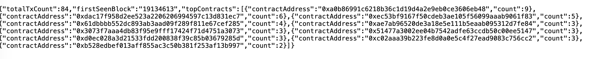
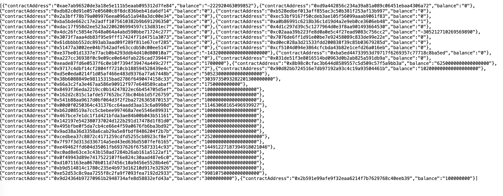
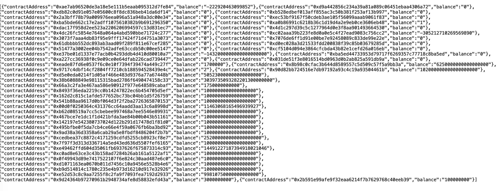

# 설계 결정 기록 (Architecture Decision Records)

실제로 부딪히면서 발견한 설계 실수와 수정 과정을 기록.
"왜 이렇게 바꿨는가"를 나중에 다시 봤을 때 이해할 수 있도록.

---

## 목차

- [ADR-01. watchBlocks 비활성화 — 블록 전체 스캔은 지갑 앱에 맞지 않음](#adr-01-watchblocks-비활성화--블록-전체-스캔은-지갑-앱에-맞지-않음)
- [ADR-02. Decimal.toString() → toFixed(0) — 지수 표기법 BigInt 변환 오류](#adr-02-decimaltostring--tofixed0--지수-표기법-bigint-변환-오류)
- [ADR-03. getStats 가 빈 데이터를 반환 — transactions vs token_transfers 혼용](#adr-03-getstats-가-빈-데이터를-반환--transactions-vs-token_transfers-혼용)

---

## ADR-01. watchBlocks 비활성화 — 블록 전체 스캔은 지갑 앱에 맞지 않음

**상황:**
서버를 처음 실행했을 때 `watchBlocks` 가 이더리움 메인넷에 연결되자마자
실시간 블록을 감지하고 블록 안의 모든 트랜잭션 receipt 를 동시에 요청했다.
이더리움 블록 1개에 트랜잭션이 약 200~400개 있고, 각각 `getTransactionReceipt`
호출이 필요해서 Alchemy 무료 플랜 속도 제한(429)에 걸려 서버가 터졌다.

**발견한 실수:**
"블록 인덱서"를 만든다고 해서 무조건 `watchBlocks` 로 전체 블록을 스캔하는
방식을 택했는데, 우리 서비스 목적은 "특정 지갑의 거래내역 조회"다.
이 목적에 전체 블록 스캔은 맞지 않는다.

```
잘못된 방향:
watchBlocks → 모든 블록 → 모든 트랜잭션 → DB 저장
→ 관련 없는 수백만 건도 저장, 비용 폭발

올바른 방향:
POST /wallets/:address/import
→ Alchemy getAssetTransfers(address) → 그 주소 거래만 가져옴 → DB 저장
```

**수정한 것:**
1. `AppModule.onApplicationBootstrap()` 에서 `blockListener.start()` 주석 처리
2. `BlockListener.onBlock()` 에 try/catch 추가 (향후 재활성화 시 크래시 방지)
3. `BlockListener.mapTransactions()` 를 `Promise.all` → 순차 처리로 변경 (429 완화)

**남은 과제:**
실시간 새 거래 감지가 필요하다면 `watchBlocks` 전체 스캔 대신
Alchemy Address Activity Webhook 으로 대체해야 함.
→ 등록된 주소에 새 거래가 생길 때만 우리 서버로 알림이 옴

---

## ADR-02. Decimal.toString() → toFixed(0) — 지수 표기법 BigInt 변환 오류

**상황:**
`GET /wallets/:address/balances` 호출 시 서버 에러:
```
SyntaxError: Cannot convert 2.6e+21 to a BigInt
```

**원인:**
Prisma 의 `Decimal` 타입은 큰 숫자를 `toString()` 하면
`"2.6e+21"` 같은 지수 표기법으로 반환한다.
`BigInt("2.6e+21")` 은 지수 표기법을 지원하지 않아 에러가 난다.

```typescript
// 문제
BigInt(row.amount.toString())  // "2.6e+21" → SyntaxError

// 해결
BigInt(row.amount.toFixed(0))  // "2600000000000000000000" → 정상
```

**수정한 것:**
`PrismaRepository` 의 모든 `Decimal → bigint` 변환을
`.toString()` → `.toFixed(0)` 으로 교체

**배운 점:**
단위 테스트에서는 FakeRepository 가 bigint 를 그대로 다루기 때문에
이 버그가 테스트에서는 전혀 안 잡혔다.
실제 Prisma + PostgreSQL 을 통과해야 나오는 버그 — 통합 테스트의 필요성.

---

## ADR-03. getStats 가 빈 데이터를 반환 — transactions vs token_transfers 혼용

**상황:**
`GET /wallets/:address/stats` 가 `{ totalTxCount: 0, firstSeenBlock: null }` 반환.
import 로 90건 데이터를 넣었는데도 0이 나왔다.

**원인:**
`WalletService.getStats()` 와 `PrismaRepository.getTopContracts()` 가
`transactions` 테이블을 조회하고 있었는데, 우리가 import 한 데이터는
`token_transfers` 테이블에만 들어있었다.

```
실제 데이터 흐름:
Alchemy import → token_transfers 테이블만 채워짐

getStats 가 조회한 것:
transactions 테이블 → 비어있음 → count = 0
```

**수정한 것:**
1. `WalletService.getStats()` → `transactions` 대신 `token_transfers` 기반으로 계산
2. `PrismaRepository.getTopContracts()` → `transaction.groupBy(toAddress)` 대신
   `tokenTransfer.groupBy(contractAddress)` 로 변경

---

### 실제 확인한 결과

**Prisma Studio — Transaction 테이블:**



- 378건 전부 `blockNumber: 24969925` — 동일한 블록 번호
- `blockHash` 도 전부 동일 → watchBlocks 가 **이더리움 블록 1개** 를 통째로 스캔한 결과
- 내 지갑(`0x824b...`)과 무관한 랜덤 사용자들의 트랜잭션

**GET /wallets/:address/balances 결과:**



- 일부 토큰 잔액이 음수 (예: WETH `-305212710269569890`)
- 원인: Alchemy `maxCount` 제한으로 일부 수신 내역 누락
- 해결 방법: 페이지네이션(`pageKey`) 처리 추가 필요

**GET /wallets/:address/stats 결과 (수정 후):**



```json
{
  "totalTxCount": 84,
  "firstSeenBlock": "19134613",
  "topContracts": [
    { "contractAddress": "0xa0b86991c6218b36c1d19d4a2e9eb0ce3606eb48", "count": 9 },
    { "contractAddress": "0xdac17f958d2ee523a2206206994597c13d831ec7", "count": 6 },
    { "contractAddress": "0xec53bf9167f50cdeb3ae105f56099aaab9061f83", "count": 5 }
  ]
}
```
- `0xa0b86...` = USDC (9회로 1위)
- `0xdac17...` = USDT (6회로 2위)
- `firstSeenBlock: 19134613` = 이 지갑의 첫 ERC-20 거래 블록

**남은 과제:**
`transactions` 테이블은 `watchBlocks` 또는 `backfill` 로만 채워진다.
지갑 앱 목적이라면 `token_transfers` 중심으로 API 를 설계하는 게 더 자연스럽다.
